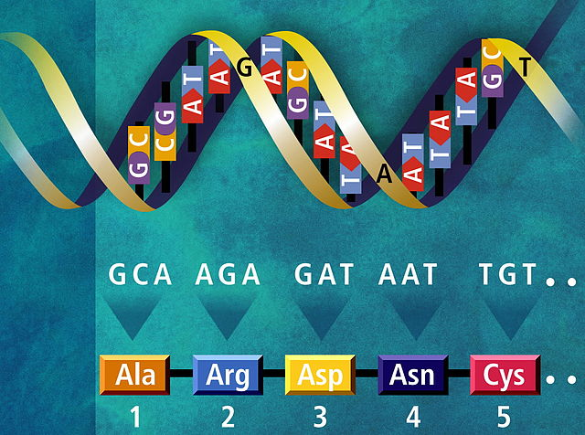

**ДНК** - [дезоксирибонуклеиновая](#dez_oxy_ribo_nuclein) [кислота](#asid).

[Макромолекула](#dna_struct), хранящая генетическую информацию. 

Обнаружена Фридрихом Мишером в 1869 году.

[Структура ДНК расшифрована](#dna_decrypt) в 1953 году.

Структура ДНК была открыта 
[Джеймсом Уотсоном](https://ru.wikipedia.org/wiki/%D0%A3%D0%BE%D1%82%D1%81%D0%BE%D0%BD,_%D0%94%D0%B6%D0%B5%D0%B9%D0%BC%D1%81) и 
[Френсисом Криком](https://ru.wikipedia.org/wiki/%D0%9A%D1%80%D0%B8%D0%BA,_%D0%A4%D1%80%D1%8D%D0%BD%D1%81%D0%B8%D1%81) в 1953 году, на основе работ 
[Мориса Уилкинса](https://ru.wikipedia.org/wiki/%D0%A3%D0%B8%D0%BB%D0%BA%D0%B8%D0%BD%D1%81,_%D0%9C%D0%BE%D1%80%D0%B8%D1%81) и 
[Розалинды Франклин](https://ru.wikipedia.org/wiki/%D0%A0%D0%BE%D0%B7%D0%B0%D0%BB%D0%B8%D0%BD%D0%B4_%D0%A4%D1%80%D0%B0%D0%BD%D0%BA%D0%BB%D0%B8%D0%BD). Спустя 9 лет - в 1962 за это открытие вручается нобелевская премия им всем, кроме Розалинды (умирает от рака в 1958 году).

Френсис Крик - умирает от рака в 2004 году.

Морис Уилкинс - умирает от рака в 2004 году.

На данный момент (2018-05-08) вживых из четвёрки остаётся только Джеймс Уотсон, недавно справивший 90-летний юбилей. Несмотря на приклонный возраст, он всё ещё занимается научной деятельностью. 

**Кислота** - любое химическое соединение, проявляющее [кислотные свойства](#asidity).

**Кислотные свойства** - способность отдавать катион водорода, либо принимать электронную пару с образованием ковалентной связи ([и в википедии ещё много страшных слов >>](https://ru.wikipedia.org/wiki/%D0%9A%D0%B8%D1%81%D0%BB%D0%BE%D1%82%D1%8B))

**Нуклеин** - название, которое даёт ДНК её первооткрыватель Фридрих Мишер. 
        
Он находит это вещество в ядрах клеток человеческой крови. Отсюда название "нуклеин" от *nucleus* - ядро. 
Проведя дополнительный химический анализ, Мишер обнаруживает у нуклеина кислотные свойства и 
переименовывает его в "нуклеиновую кислоту", т.е. простыми словами, кислота из ядра клетки. 

Мишер не подозревает о важности сделанного им открытия. Аномально большое содержание атомов фтора в нуклеине 
заставляет его сделать ошибочный вывод, что нуклеин используется человеческими клетками для складирования фтора.

**Дезоксирибонуклеин** - сложносоставной термин, который может быть вольно перефразирован как [нуклеиновая](#nuclein) [дезоксирибоза](#dez_oxy_ribo)

**Дезоксирибоза** - вещество, производное от [моносахарида](#mono_shugger) [рибозы](#riboza).

"Дез" - латинский префикс, означающий "без \[чего-то\]".

"Окси" - от латинского *oxygenium* - кислород.

"Дезокси" таким образом означает "без кислорода". Т.е. это молекула рибозы, от которой оторвали один атом кислорода.

**Полисахарид** - комплексная молекула, состоящая из двух и более молекул моносахаридов

Пищевой сахар - это полисахарид (по-научному его называют сахарозой).

**Сахара** - один из основных видов [углеводов](#carbohydrate).

**Углеводы** - это такие органические молекулы, используемые клетками живых существ для складирования и добычи энергии.

**Моносахарид** - органическое вещество, относящееся к одноимённой подгруппе [сахаров](#shugger) (второй подгруппой являются [полисахариды](#poly_shugger))

**Рибоза** - моносахарид, открытый в начале XX века немецким химиком Эмилем Фишером. 

Судя по сведениям, подчерпнутым из различных источнков, название было придуманно им "от балды" (просто слово красивое, и звучит прикольно).

ДНК состоит из двух дублирующих друг друга цепочек [нуклеотидов](#nucliotid), скрученных в спираль. 

В ядре каждой клетки лежит по одной копии ДНК. В развёрнутом состоянии молекула ДНК человека имеет длину примерно 2 метра, при толщине в 2 нанометра (2*10-9м). 
В клетках молекула хранится в свёрнутом состоянии.

**Нуклеотиды** - группа органических соединений, примечательные восновном тем, что четырьмя из них (аденин (A), темин (T), гуанин (G), циозин (C)) кодируется генетический код. 

Вотличие от цифрового кодирования, базирующегося на двух элементах (0 и 1), [генетический код](#genetic_code) таким образом базируется на четырёх (A, T, G и C).  

**Генетический код** - способ кодирования последовательностей аминокислот в составе белков при помощи последовательностей нуклиотидов. Основным носителем генетического кода являются молекулы [ДНК](#dna).

